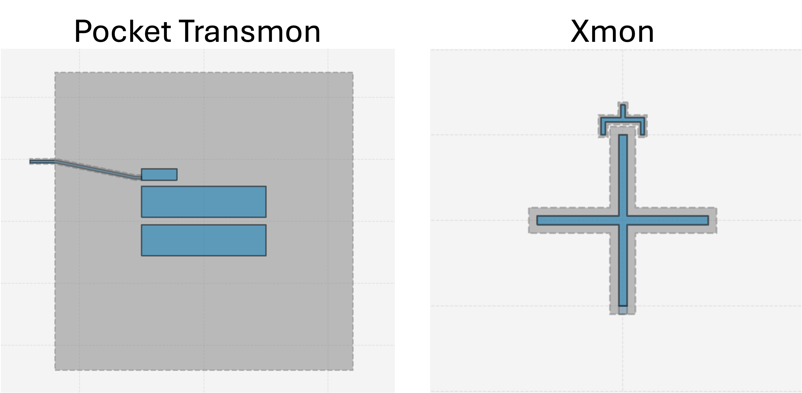

## Electrostatic Simulations of Superconducting Qubits to extract Hamiltonian parameters

Below we have examples of electrostatic simulations for two different styles of superconducting qubits, a pocket (or double-pad) transmon and an xmon. For each simulation, we use capacitance matrix results to extract their corresponding Hamiltonian parameters with scQubits. 

The pocket transmon and xmon designs (generated with [Qiskit Metal](https://qiskit-community.github.io/qiskit-metal/)) are shown below. The corresponding Qiskit Metal code to generate these devices can be found [here](qiskit-metal_qubit_builder.ipynb). 

<p align="center">
  
</p>

The designs were meshed using [Cubit](https://cubit.sandia.gov/). The meshfile for the pocket transmon can be found [here](pocket_transmon.bdf) and the xmon [here](xmon.bdf).

**Table of Contents**
[pyPalace Code](#pyPalace-code-to-generate-the-electrostatic-config-files-and-run-the-simulations)
* pyPalace code to generate and run AWS Palace electrostatic simulations for each qubit.

[Quantum Analysis](#quantum-analysis-with-scqubits-to-extract-hamiltonian-parameters)
* Extract Palace electrostatic simulation results for both qubit geometries and extract their Hamiltonian parameters with scQubits

## pyPalace Code to Generate and Run AWS Palace Electrostatic Simulations

The following code can be found in [this notebook](pyPalace_electrostatic_qubit_example.ipynb). 

```python
from pypalace import Config, Model, Domains, Boundaries, Solver, Simulation

''' path to Palace install ''' 
path_to_palace = "/Users/firasabouzahr/Desktop/AWSPalace/install/bin/palace-arm64.bin"
```

### Pocket Transmon

```python
''' define config object (Problem) and Model '''
pocket_config = Config(Type="Electrostatic",Output="pocket_electro_output")
pocket_config.add_Model(pocket_meshfile)

''' Materials '''
silicon = Domains.Material([1],1.0,11.45,0.0) # silicon 
air = Domains.Material([2],1.0,1.0,0.0) # air
pocket_config.add_Domains(Materials=[silicon,air]) # add the materials

''' Boundary Conditions '''
## terminals ##
top_pad_terminal = Boundaries.Terminal(Index=1,Attributes=[3]) # top capacitor pad 
bottom_pad_terminal = Boundaries.Terminal(Index=2,Attributes=[4]) # bottom capacitor pad
coupler_terminal = Boundaries.Terminal(Index=3,Attributes=[5]) # qubit-res coupler
resonator_terminal = Boundaries.Terminal(Index=4,Attributes=[6]) # resonator coupler - we won't use this but must assign it something

## Ground ##
Grounds = Boundaries.Ground(Attributes=[7,8]) # ground plane, far field

''' Boundary Postprocessing '''
top_pad_sf = Boundaries.Postprocessing_SurfaceFlux(Index=1,Attributes=[3],Type="Electric")
bottom_pad_sf = Boundaries.Postprocessing_SurfaceFlux(Index=2,Attributes=[4],Type="Electric")
coupler_pad_sf = Boundaries.Postprocessing_SurfaceFlux(Index=3,Attributes=[5],Type="Electric")
resonator_sf = Boundaries.Postprocessing_SurfaceFlux(Index=4,Attributes=[6],Type="Electric")

## add boundary conditions and boundary postprocessing
pocket_config.add_Boundaries(BCs=[top_pad_terminal,bottom_pad_terminal,coupler_terminal,Grounds],
                             Postprocessing=[top_pad_sf,bottom_pad_sf,coupler_pad_sf,resonator_sf])

''' electrostatic simulation and linear solver paramters ''' 
electro_params = Solver.Electrostatic(Save=3)

Linear_params = Solver.Linear(Type="BoomerAMG",
                              KSPType = "CG",
                              Tol = 1e-6,
                              MaxIts = 500)
                              
pocket_config.add_Solver(Simulation=electro_params,
                     Order= 2, # second order solver
                     Linear=Linear_params)

''' save config '''
pocket_path_to_json = "pocket_transmon-electrostatic_sim.json"
pocket_config.save_config(pocket_path_to_json)

''' run the simulation '''
pocket_simulation = Simulation(path_to_palace,pocket_path_to_json)
pocket_simulation.run_palace(n=5) # 5 mpi processses
```

This will print out the AWS Palace terminal log output. See notebook example.

### Xmon

```python
''' define config object (Problem) and Model '''
xmon_config = Config(Type="Electrostatic",Output="xmon_electro_output")
xmon_config.add_Model(xmon_meshfile)

''' Materials '''
silicon = Domains.Material([1],1.0,11.45,0.0) # silicon 
air = Domains.Material([2],1.0,1.0,0.0) # air
xmon_config.add_Domains(Materials=[silicon,air]) # add the materials

''' Boundary Conditions '''
## terminals ##
cross_terminal = Boundaries.Terminal(Index=1,Attributes=[3]) # qubit cross
claw_terminal = Boundaries.Terminal(Index=2,Attributes=[4]) # claw

## Ground ##
Grounds = Boundaries.Ground(Attributes=[5,6]) # ground plane, far field

''' Boundary Postprocessing '''
cross_sf = Boundaries.Postprocessing_SurfaceFlux(Index=1,Attributes=[3],Type="Electric")
claw_sf = Boundaries.Postprocessing_SurfaceFlux(Index=2,Attributes=[4],Type="Electric")

## add boundary conditions and boundary postprocessing
xmon_config.add_Boundaries(BCs=[cross_terminal,claw_terminal,Grounds],
                             Postprocessing=[cross_sf,claw_sf])

''' electrostatic simulation and linear solver paramters ''' 
electro_params = Solver.Electrostatic(Save=3)

Linear_params = Solver.Linear(Type="BoomerAMG",
                              KSPType = "CG",
                              Tol = 1e-6,
                              MaxIts = 500)
                              
xmon_config.add_Solver(Simulation=electro_params,
                       Order= 2, # second order solver
                       Linear=Linear_params)

''' save config '''
xmon_path_to_json = "xmon-electrostatic_sim.json"
xmon_config.save_config(xmon_path_to_json)

''' run the simulation '''
xmon_simulation = Simulation(path_to_palace,xmon_path_to_json)
xmon_simulation.run_palace(n=5) # 5 mpi processses
```

This will print out the AWS Palace terminal log output. See notebook example.

Note in this repository we only include the ```terminal-C.csv``` dataset for each of these simulations, however, the simulation actually outputs a lot of other useful data such as the surface flux, electrostatic energy, and ParaView files for visualization. 


## Quantum Analysis with scQubits to extract Hamiltonian Parameters

The following code with additional commentary can be found in [this notebook](Hamiltonian_params_with_scQubits.ipynb).

```python
import scqubits as scq
import pandas as pd
import matplotlib.pyplot as plt
import numpy as np
from scipy.constants import e,h,pi
phi0 = 2.0678338484619295e-15 # flux quantum

## choose LJ for your qubit ##
LJ = 10e-9 # 10 nH 
EJ = phi0**2/((2*np.pi)**2*LJ)
EJ_MHz = EJ / h * 1e-6 # convert to MHz
```

### Pocket Transmon 

```python
pocket_df = pd.read_csv("pocket_electro_output/terminal-C.csv",usecols =[1,2,3]) # dropped palace index labeling

'''extract capacitance and calculate Ec'''
C_tp = pocket_df.iloc[0][0] # self-capacitance of top pad
C_bp = pocket_df.iloc[1][1] # self-capacitance of bottom pad
C_mutal = abs(pocket_df.iloc[0][1]) # mutal capacitance between pads

## total shunt capacitance ##
C_sigma_pocket = C_tp + C_bp - 2*C_mutal

## calculate qubit charging energy 
EC_pocket = e**2/(2*C_sigma_pocket) 
EC_pocket_MHz = EC_pocket / h * 1e-6 # convert to MHz

'''extract Hamiltonian parameters with scQubits'''
pocket_transmon = scq.Transmon(EJ=EJ_MHz,
                              EC=EC_pocket_MHz,
                              ng=0,
                              ncut=31)

f_q_pocket = pocket_transmon.E01() / 1000 # in GHz
alpha_pocket = pocket_transmon.anharmonicity() # in MHz

print("=====================================")
print("Hamitlonian Parameters:")
print("Qubit Frequency = {} GHz".format(np.round(f_q_pocket,2)))
print("Qubit Anharmonicity = {} MHz".format(np.round(alpha_pocket,2)))
print("=====================================")
```

This prints out:

```
=====================================
Hamitlonian Parameters:
Qubit Frequency = 4.27 GHz
Qubit Anharmonicity = -163.34 MHz
=====================================
```

### Xmon

```python
xmon_df = pd.read_csv("xmon_electro_output/terminal-C.csv",usecols =[1,2]) # dropped palace index labeling

'''extract capacitance and calculate Ec'''
## total shunt capacitance ##
C_sigma_xmon = xmon_df.iloc[0][0]

## calculate qubit charging energy 
EC_xmon = e**2/(2*C_sigma_xmon) 
EC_xmon_MHz = EC_xmon / h * 1e-6 

'''extract Hamiltonian parameters with scQubits'''
xmon = scq.Transmon(EJ=EJ_MHz,
                    EC=EC_xmon_MHz,
                    ng=0,
                    ncut=31)

f_q_xmon = xmon.E01() / 1000 # in GHz
alpha_xmon = xmon.anharmonicity() # in MHz

print("=====================================")
print("Hamitlonian Parameters:")
print("Qubit Frequency = {} GHz".format(np.round(f_q_xmon,2)))
print("Qubit Anharmonicity = {} MHz".format(np.round(alpha_xmon,2)))
print("=====================================")
```

This prints out:

```
=====================================
Hamitlonian Parameters:
Qubit Frequency = 4.63 GHz
Qubit Anharmonicity = -195.12 MHz
=====================================
```
