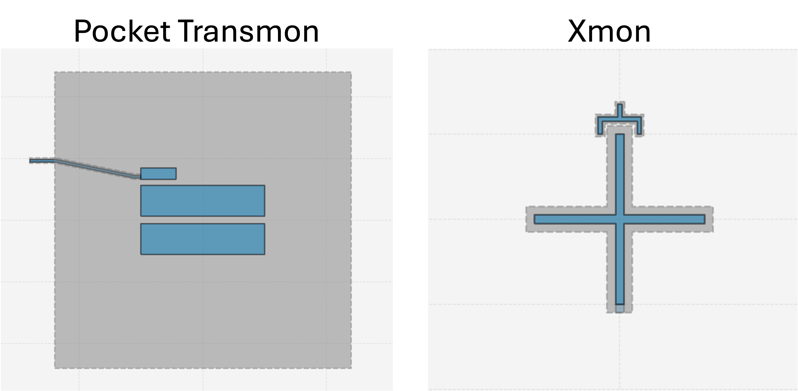

# Electrostatic Simulations and LOM Analysis of Superconducting Qubits

Below we have examples of electrostatic simulations for two different styles of superconducting qubits, a pocket (or double-pad) transmon and an xmon. For each simulation, we use capacitance matrix results to extract their corresponding Hamiltonian parameters with scQubits. 

The pocket transmon and xmon designs (generated with [Qiskit Metal](https://qiskit-community.github.io/qiskit-metal/)) are shown below. The corresponding Qiskit Metal code to generate these devices can be found [here](qiskit-metal_qubit_builder.ipynb). 

<p align="center">
  
</p>

The designs were meshed using [Cubit](https://cubit.sandia.gov/). The meshfile for the pocket transmon can be found [here](pocket_transmon.bdf) and the xmon [here](xmon.bdf).


## Example code

The full notebook can be found in [this notebook](pyPalace_electrostatic_qubit_example.ipynb). 

```python
from pypalace import Config, Simulation,Tools
from pypalace.builder import Model, Domains, Boundaries, Solver

''' path to Palace install ''' 
path_to_palace = "/Users/firasabouzahr/Desktop/AWSPalace/install/bin/palace-arm64.bin"
```

## Pocket Transmon

### Build config file and run simulation of pocket transmon

```python
pocket_meshfile = "pocket_transmon.bdf"
pocket_path_to_json = "pocket_transmon-electrostatic_sim.json"

''' Define config object '''
pocket_config = Config(pocket_path_to_json)

''' Problem and Model '''
pocket_config.add_Problem(Type="Electrostatic",Output="pocket_electro_output")
pocket_config.add_Model(pocket_meshfile) # no AMR, meshed finely already

''' Materials '''
silicon = Domains.Material([1],1.0,11.45,0.0) # silicon 
air = Domains.Material([2],1.0,1.0,0.0) # air
pocket_config.add_Domains(Materials=[silicon,air]) # add the materials

''' Boundary Conditions '''
## terminals ##
top_pad_terminal = Boundaries.Terminal(Index=1,Attributes=[3]) # top capacitor pad 
bottom_pad_terminal = Boundaries.Terminal(Index=2,Attributes=[4]) # bottom capacitor pad
coupler_terminal = Boundaries.Terminal(Index=3,Attributes=[5]) # qubit-res coupler
resonator_terminal = Boundaries.Terminal(Index=4,Attributes=[6]) # truncated resonator - we won't use this but must assign it something

## Ground ##
Grounds = Boundaries.Ground(Attributes=[7,8]) ## ground plane, far field

''' Boundary Postprocessing '''
top_pad_sf = Boundaries.Postprocessing_SurfaceFlux(Index=1,Attributes=[3],Type="Electric")
bottom_pad_sf = Boundaries.Postprocessing_SurfaceFlux(Index=2,Attributes=[4],Type="Electric")
coupler_pad_sf = Boundaries.Postprocessing_SurfaceFlux(Index=3,Attributes=[5],Type="Electric")
resonator_sf = Boundaries.Postprocessing_SurfaceFlux(Index=4,Attributes=[6],Type="Electric")

## add boundary conditions and boundary postprocessing
pocket_config.add_Boundaries(BCs=[top_pad_terminal,bottom_pad_terminal,coupler_terminal,Grounds],
                             Postprocessing=[top_pad_sf,bottom_pad_sf,coupler_pad_sf,resonator_sf])

''' electrostatic simulation and linear solver paramters ''' 
electro_params = Solver.Electrostatic(Save=3)

Linear_params = Solver.Linear(Type="BoomerAMG",
                              KSPType = "CG",
                              Tol = 1e-6, # make more stringent for better results
                              MaxIts = 25)
                              
pocket_config.add_Solver(Simulation=electro_params,
                     Order= 2, # second order solver
                     Linear=Linear_params)

''' save config '''
pocket_config.save_config()

''' run the simulation '''
pocket_simulation = Simulation(pocket_config,path_to_palace)
capacitance_matrix = pocket_simulation.run(n=5) # 5 mpi processses
```

This will print out the AWS Palace terminal log output. See notebook example.


### LOM Analysis
```python
from pypalace.analysis import LOM

C00 = capacitance_matrix.iloc[0,0]
C11 = capacitance_matrix.iloc[1,1]
C01 = capacitance_matrix.iloc[0,1]
C02 = capacitance_matrix.iloc[0,2]

C_Sigma = abs(C01) + ((C00 + C01)*(C11+C01))/(C00 + C11 + 2*C01) + abs(C02)
LJ = 10e-09

Hamiltonian_params = LOM.get_Hamiltonian_parameters(C_Sigma,LJ)
Hamiltonian_params
```
{'frequency_GHz': 5.123972820277544, 'anharmonicity_MHz': -244.22663291970457}

## Xmon

### Build config file and run simulation of xmon

```python
xmon_meshfile = "xmon.bdf"
xmon_path_to_json = "xmon-electrostatic_sim.json"

''' Define config object '''
xmon_config = Config(xmon_path_to_json)

''' Problem and Model '''
xmon_config.add_Problem(Type="Electrostatic",Output="xmon_electro_output")
xmon_config.add_Model(xmon_meshfile) # no AMR, meshed finely already

''' Materials '''
silicon = Domains.Material([1],1.0,11.45,0.0) # silicon 
air = Domains.Material([2],1.0,1.0,0.0) # air
xmon_config.add_Domains(Materials=[silicon,air]) # add the materials

''' Boundary Conditions '''
## terminals ##
cross_terminal = Boundaries.Terminal(Index=1,Attributes=[3]) # qubit cross
claw_terminal = Boundaries.Terminal(Index=2,Attributes=[4]) # claw

## Ground ##
Grounds = Boundaries.Ground(Attributes=[5,6]) # ground plane, far field

''' Boundary Postprocessing '''
cross_sf = Boundaries.Postprocessing_SurfaceFlux(Index=1,Attributes=[3],Type="Electric")
claw_sf = Boundaries.Postprocessing_SurfaceFlux(Index=2,Attributes=[4],Type="Electric")

## add boundary conditions and boundary postprocessing
xmon_config.add_Boundaries(BCs=[cross_terminal,claw_terminal,Grounds],
                             Postprocessing=[cross_sf,claw_sf])

''' electrostatic simulation and linear solver paramters ''' 
electro_params = Solver.Electrostatic(Save=3)

Linear_params = Solver.Linear(Type="BoomerAMG",
                              KSPType = "CG",
                              Tol = 1e-6, # make more stringent for better results
                              MaxIts = 25) 
                              
xmon_config.add_Solver(Simulation=electro_params,
                       Order= 2, # second order solver
                       Linear=Linear_params)

''' save config '''
xmon_config.save_config()

''' run the simulation '''
xmon_simulation = Simulation(xmon_config,path_to_palace)
capacitance_matrix = xmon_simulation.run(n=5) # 5 mpi processses
```

### LOM Analysis
```python
C00 = capacitance_matrix.iloc[0,0]

C_Sigma = C00
LJ = 10e-09 # 10 nH

Hamiltonian_params = LOM.get_Hamiltonian_parameters(C_Sigma,LJ)
Hamiltonian_params
```
{'frequency_GHz': 4.63089052046631, 'anharmonicity_MHz': -195.1212942191978}
