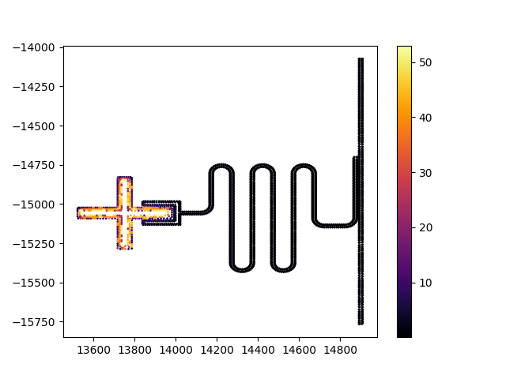
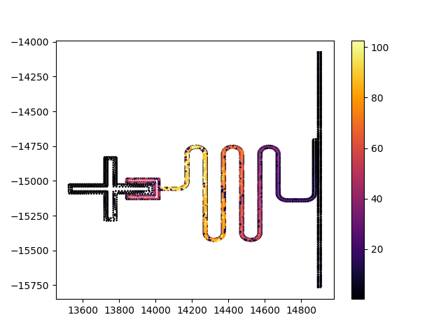

## Example 01 (Eigenmode simulations & EPR analysis of a cavity-qubit system)

Example 01 is split into three python scripts.
* [example01_script.py](example01_script.py) builds the eigenmode config object/file and runs the simulation on an HPC (w/ slurm).
* [example01_field_visualization.py](example01_field_visualization.py) plots the electric field magnitude of different modes with the pyPalace tool ```Simulation.plot_field()```. We use this to identify which modes correspond to the qubit and the resonator, respectively. **Note:** paraview files are too large to uplaod to Github. In order to try this script run example01_script.py first to execute the simulation.
* [example01_analysis.py](example01_analysis.py) extracts simulation results and uses the EPR method to calculate the system Hamiltonian parameters.

Below we show the qubit and resonator modes generated with ```Simulation.plot_field()```. The colorscale is the magnitude of the electric field ($||E||$) [V/m]. The visualization confirms that the qubit corresponds to mode 1 and the resonator to mode 2.

<p align="center">
  
  
</p>

## Benchmarking

We benchmark the compute resources needed for this simulation (time and RAM) as a function of the number of CPUs on one HPC node. We keep the number of MPI processes equal to CPUs as standard practice.


