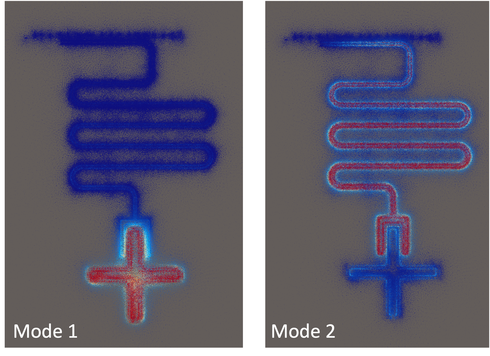
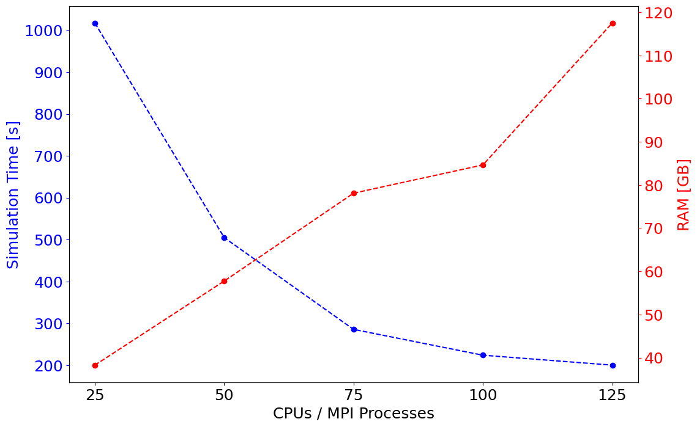

## Example 01 (Eigenmode simulations & EPR analysis of a cavity-qubit system)

Example 01 is split into two python scripts:
* [example01_script.py](example01_script.py) builds the eigenmode config object/file and runs the simulation on an HPC (w/ slurm).
* [example01_analysis.py](example01_analysis.py) extracts simulation results and uses the EPR method to extract the system Hamiltonian parameters.

Below are qubit & resonator modes from the eigenmode simulations visualized in ParaView.

## Benchmarking

We benchmark the compute resources needed for this simulation (time and RAM) as a function of the number of CPUs on one HPC node. We keep the number of MPI processes equal to CPUs as standard practice.

