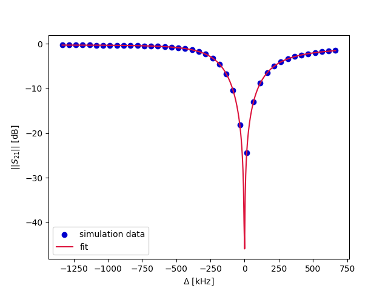

### Example 03 (Frequency-domain driven simulation of a resonator & DCM fitting to $S_{21}$ to extract its parameters)

Example 03 is split into two parts:
1. [example03_script.py](example03_script.py) builds & runs the Palace driven simulation of our resonator on an HPC
2. [example03_analysis_notebook.ipynb](example03_analysis_notebook.ipynb) analyzes the results of the simulation to extract the resonator frequency and linewdith (kappa). 

In practice, you should first run [example03_script.py](example03_script.py) to execute the driven resonator simulation and then run [example03_analysis_notebook.ipynb](example03_analysis_notebook.ipynb) to analyze the results. However, for convenience, the needed results of the simulation have been uploaded to this directory already, so you can run the analysis notebook as standalone code.

Below we plot the fit to the resonator lineshape as done in the analysis notebook.

  

