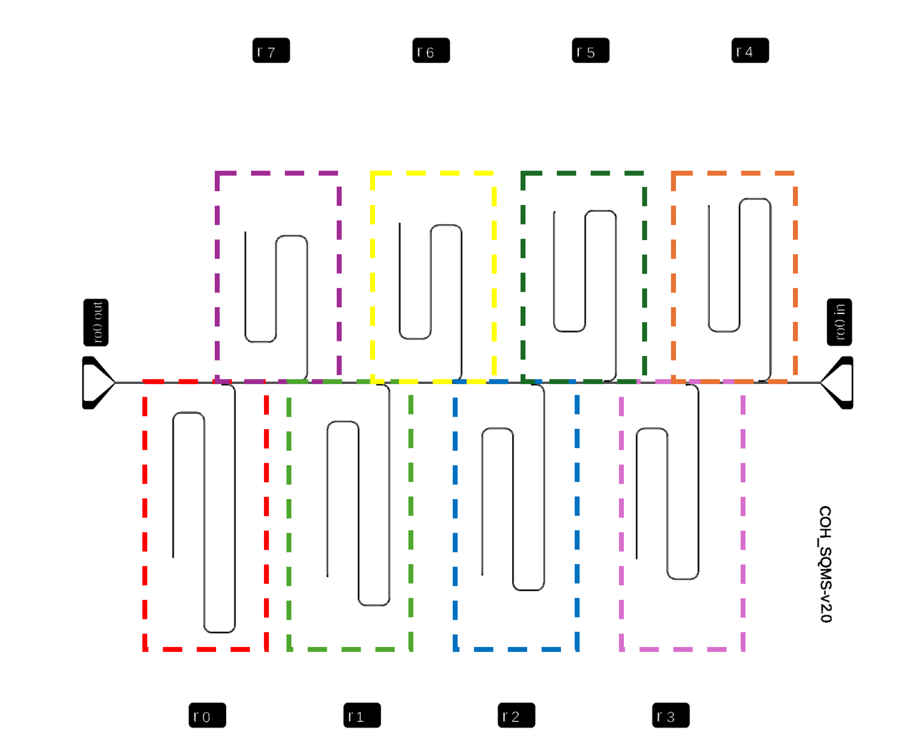

Here we go over a few examples that showcase how pyPalace is well-suited for iterative studies. By using pyPalace's config generating syntax with its HPC interface, we can streamline generating config files and then directly submitting each simulation as a slurm job all in the same script. Alternatively, if running on 


## Simulating a full chip as system of independent subsystems

If there is negligible parasitic coupling between neighboring circuit elements in a superconducting quantum device we can safely simulate each subcircuit individually. In this example, we consider the following device from [this paper](https://arxiv.org/pdf/2204.07202). Since the circuit has negligble coupling between the resonators, we can "dice" the chip into 8 indiviudal resonator subsystems and simulate each individually. In the figure below, we illustrate these 8 indiviudal resonator subsystems, we include the full feedline with lumped ports on both ends for each resonator subsystem in order to extract the coupling quality factors ($Q_c$) between each resonator and the feedline (see this background information from [AWS Palace](https://awslabs.github.io/palace/dev/reference/#Energy-participation-ratios)). In practice however to minimize the size of the problem, we could have also truncate each subsystem to only contain a small portion of the feedline that's directly above it.

<p align="center">
  
</p>

We dice this chip and mesh each resonator subsystem separately, an example of one of the meshed subsystems is shown below:


<p align="center">
  
</p>

Now we are ready to iteraively generate the config files and submit each one to be simulated on an HPC using the slurm HPC manager. The code shown below can be found [here](simulate_8_resonator_chip.py).

```python
from pypalace import Config, Model, Domains, Boundaries, Solver, Simulation

for i in range(8):
    current_mesh = "res{}.bdf".format(i)
    my_config = Config("Eigenmode",Output="res{}_output".format(i)) # config["Problem"]

    # define config["Model"] block
    my_config.add_Model(current_mesh,L0=1e-6)#,Refinement=my_refinement)

    # define materials
    sapphire = Domains.Material(Attributes = [1],
                                Permeability=[1.0,1.0,1.0],
                                Permittivity=[9.3,9.3,11.4], # anisotropic
                                LossTan=[15*10**(-4)]*3, # EFG sapphire loss tangent from https://arxiv.org/pdf/2206.14334
                                MaterialAxes=[[1,0,0],[0,1,0],[0,0,1]])
    air = Domains.Material([2],1.0,1.0,0.0)
    my_materials = [sapphire,air] # material list for input into add_Domains()
    
    # define boundary conditions
    PECs = Boundaries.PEC([3,4,7,8]) # resonator, feedline, ground_plane, far_field
    left_LP = Boundaries.LumpedPort(Index=1,Attributes=[5],Direction="+X",R=50,L=0,C=0)
    right_LP = Boundaries.LumpedPort(Index=2,Attributes=[6],Direction="-X",R=50,L=0,C=0)
    my_BCs = [PECs,left_LP,right_LP] # boundary condition list for input into add_Boundaries()
    
    # add config["Domains"] and config["Boundaries"] using our material and BC lists above
    my_config.add_Domains(my_materials)
    my_config.add_Boundaries(my_BCs)

    ## eigenmode parameters
    eigenmode_params = Solver.Eigenmode(Target = 3.0,
                                        Tol = 1.0e-8,
                                        N = 4,
                                        Save = 4)
    ## linear solver parameters
    Linear_params = Solver.Linear(Type="Default",
                                  KSPType = "Default",
                                  Tol = 1e-8,
                                  MaxIts = 50)
    
    ## add them to config["Solver"] and solver["Linear"]
    my_config.add_Solver(Simulation=eigenmode_params,Order = 2,Linear=Linear_params)
    
    ## save this config
    current_config = "res{}_config.json".format(i)
    my_config.save_config(current_config) # checks validity of file and raises error if something is missing
    
    
    ##################################################
    ##################################################
    #### create slurm scripts and submit HPC jobs ####
    ##################################################
    ##################################################
    
    
    palace = "/projects/p32999/palace/palace_install/bin/palace-x86_64.bin"
    config = "/projects/p32999/pyPalace/{}".format(current_config)
    my_sim = Simulation(palace,config)
    
    HPC_options = Simulation.HPC_options(
                                    partition="short", # #SBATCH --partition=short
                                    time="00:30:00", # #SBATCH --time=00:30:00
                                    nodes=1, # #SBATCH --nodes=1
                                    ntasks_per_node=100, # #SBATCH --ntasks-per-node=30
                                    mem=100, # #SBATCH --mem=64G
                                    job_name="res{}".format(i), # #SBATCH --job-name=test-job
                                    custom=["account=p32999"]) # custom directives you want to add to the job script, for example at my university we need to add account
                                    
                                    
    my_sim.run_palace_HPC(n=100, # number of MPI processes
                          HPC_options=HPC_options, # Slurm directives (e.g, request HPC resources)
                          custom_script_name="jobscript_res{}".format(i)) 

```

After running this script, we see the following terminal output (printed in the script):

```
Submitted batch job 3465163

Submitted batch job 3465164

Submitted batch job 3465166

Submitted batch job 3465168

Submitted batch job 3465169

Submitted batch job 3465170

Submitted batch job 3465171

Submitted batch job 3465172
```

And if we check the job queue with:

```
$ squeue -u <your_user>
            JOBID PARTITION     NAME     USER      ST       TIME    NODES NODELIST(REASON)
           3465163     short     res0  <your_user> PD       0:00      1 (Resources)
           3465164     short     res1  <your_user> PD       0:00      1 (Priority)
           3465166     short     res2  <your_user> PD       0:00      1 (Priority)
           3465168     short     res3  <your_user> PD       0:00      1 (Priority)
           3465169     short     res4  <your_user> PD       0:00      1 (Priority)
           3465170     short     res5  <your_user> PD       0:00      1 (Priority)
           3465171     short     res6  <your_user> PD       0:00      1 (Priority)
           3465172     short     res7  <your_user> PD       0:00      1 (Priority)
```


## Iterating on a single qubit's design and inductance
