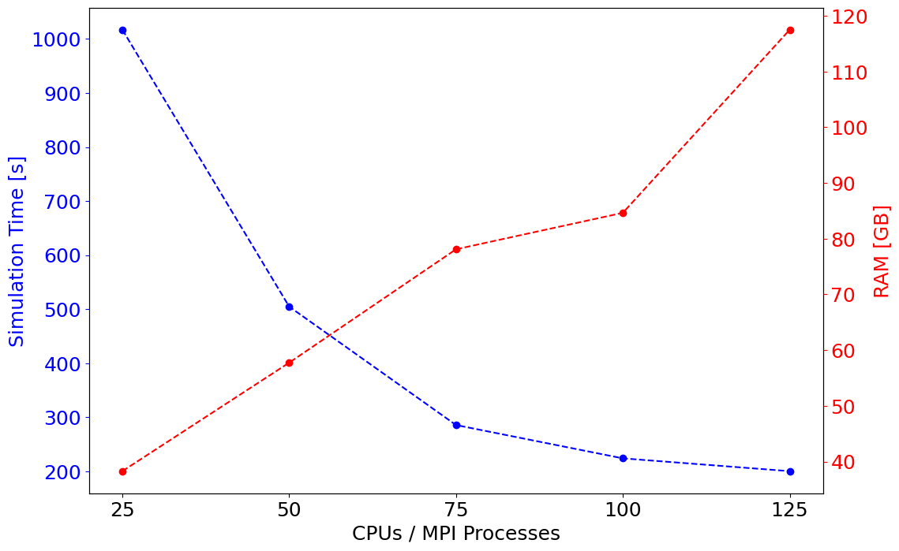

This example creates an AWS Palace config file for an eigenmode simulation of a superconducting circuit consisting of a single qubit-resonator subsystem (with a truncated feedline). The mesh file can be found [above](qubit_resonator_mesh.bdf).

Below are images of the device, its corresponding mesh, and the qubit mode from the eigenmode simulation visualized in ParaView.


**Table of Conents:**
* [Creating an eigenmode config file with pyPalace](#creating-an-eigenmode-config-file-for-this-device-with-pyPalace)
* [EPR Analysis](#epr-analysis)

## Creating an eigenmode config file for this device with pyPalace

The example outlined below can be found in [this python script](qubit_res_eigenmode_example.py) or this [this notebook](qubit_res_eigenmode_example.ipynb).

We start by importing the needed pyPalace libraries:

```python
from pypalace import Simulation, Config, Model, Domains, Boundaries, Solver
```

First let's create the config object (automatically creates config["Problem"] and also define config["Model"].

```python
meshfile = "qubit_resonator_mesh.bdf"
my_config = Config("Eigenmode",Output="eigenmode_output") # config["Problem"]
 
# define adaptive mesh refinement, the qubit is coarsely meshed to save on file size so we use AMR to boost simulation accuracy
my_refinement = Model.Refinement(Tol = 1e-6,MaxIts = 4)

# define config["Model"] block
my_config.add_Model(meshfile,L0=1e-6,Refinement=my_refinement)
```

Before we start assigning material properties and boundary conditions, let's take look at the attributes in the mesh file: 

```python
my_attributes = Simulation.get_mesh_attributes(meshfile)
my_attributes
```

This outputs the following pandas dataframe:


So we have the following attributes:

**Volumes**
* we'll define substrate (1) as sapphire
* and we'll define air (2) as a vacuum.

**Surfaces**
* feedline (3), resonator (4), and qubit (5), and ground plane (7) are the superconducting components which we will define as PEC
* JJ (6) is the Josephson junction, we will define this as a lumped port with inductance $L_J$ = 10.4 nH
* far field (8) is the geometry closing boundary, we will also define this as PEC. Some folk define it as an absorbing boundary condition instead.


Now we define our materials and boundary conditions and add them to the config["Domains"] and config["Boundaries"] blocks.
```python
# define materials
sapphire = Domains.Material(Attributes = [1],Permeability=1.0,Permittivity=[9.3,9.3,11.4],MaterialAxes=[[1,0,0],[0,1,0],[0,0,1]],LossTan=8.6e-5)
air = Domains.Material([2],1.0,1.0,0.0)
my_materials = [sapphire,air] # material list for input into add_Domains()

# define boundary conditions
PECs = Boundaries.PEC([3,4,5,7,8]) # 
JJ = Boundaries.LumpedPort(Index=1,Attributes=[6],Direction="+X",R=0,L=round(10.4*10**(-9),9),C=0) 
my_BCs = [PECs,JJ] # boundary condition list for input into add_Boundaries()

# add config["Domains"] and config["Boundaries"] using our material and BC lists above
my_config.add_Domains(my_materials)
my_config.add_Boundaries(my_BCs)
```

Define eigenmode and linear solver parameters
```python
## eigenmode parameters
eigenmode_params = Solver.Eigenmode(Target = 3.0,
                                    Tol = 1.0e-8,
                                    N = 6,
                                    Save = 6)
## linear solver parameters
Linear_params = Solver.Linear(Type="Default",
                              KSPType = "Default",
                              Tol = 1e-8,
                              MaxIts = 50)

## add them to config["Solver"] and solver["Linear"]
my_config.add_Solver(Simulation=eigenmode_params,Order = 2,Linear=Linear_params)
```

We have defined everything we need so let's print out the config file to see what it looks like:
```python
my_config.print_config()
```
```
{
  "Problem": {
    "Type": "Eigenmode",
    "Verbose": 2,
    "Output": "eigenmode_output"
  },
  "Model": {
    "Mesh": "qubit_resonator_mesh.bdf",
    "L0": 1e-06,
    "Refinement": {
      "Tol": 1e-06,
      "MaxIts": 4
    }
  },
  "Domains": {
    "Materials": [
      {
        "Attributes": [
          1
        ],
        "Permeability": 1.0,
        "Permittivity": [
          9.3,
          9.3,
          11.4
        ],
        "LossTan": 8.6e-05,
        "MaterialAxes": [
          [
            1,
            0,
            0
          ],
          [
            0,
            1,
            0
          ],
          [
            0,
            0,
            1
          ]
        ]
      },
      {
        "Attributes": [
          2
        ],
        "Permeability": 1.0,
        "Permittivity": 1.0,
        "LossTan": 0.0
      }
    ]
  },
  "Boundaries": {
    "PEC": {
      "Attributes": [
        3,
        4,
        5,
        7,
        8
      ]
    },
    "LumpedPort": [
      {
        "Index": 1,
        "Attributes": [
          6
        ],
        "Direction": "+X",
        "R": 0,
        "L": 1e-08,
        "C": 0
      }
    ]
  },
  "Solver": {
    "Order": 2,
    "Device": "CPU",
    "Eigenmode": {
      "N": 6,
      "Save": 6,
      "Type": "Default",
      "Target": 3.0,
      "Tol": 1e-08
    },
    "Linear": {
      "Type": "Default",
      "KSPType": "Default",
      "Tol": 1e-08,
      "MaxIts": 50
    }
  }
}
```
The MaterialAxes definition for sapphire gets a bit ugly in the config file... working to beautify it (:

Save the config file
```python
my_config.save_config("qubit_res.json",check_validity=True) # checks validity of file and raises error if something is missing
```

## EPR Analysis

#### Assuming we've ran the above simulation, we can now do EPR analysis to get our Hamiltonian parameters including:
* the qubit anharmonicity, alpha.
* the qubit-resonator dispersive shift, chi.
* the qubit-resonator coupling strength, g.
  
We can run Palace [directly with pyPalace](https://github.com/FirasAbouzahr/pyPalace/blob/main/Examples/README.md) or we could've ran it directly in terminal.

There are two ways we can do EPR calculations with pyPalace:

1. Create a Simulation object to automatically calculate parameters. With a simulation object you do not have to enter any parameters manually. Given the config file path, it will extract all needed parameters (e.g., qubit frequency, resonator frequency, $E_J$, and all EPRs) from the config file and the simulation output folder.
2. Use pyPalace Simulation EPR analysis by manually entering all relevant parameters (e.g., qubit frequency, resonator frequency, $E_J$, and all EPRs) directly into the function defintions.

### Method 1: Using a Simulation Object

We start by creating a Simulation object. We do not to actually define ```path_to_palace``` below as we are not running the simulation with pyPalace here, we'll assume we ran it directly in terminal and already have simulation results.


```python
# path_to_palace is only needed if we want to use Simulation to actually execute a simulation
my_sim = Simulation(path_to_palace=None,path_to_json="qubit_res.json")
```

The there are only three pieces of information we must know for method 1: the qubit mode number, the resonator mode number, and the JJ's lumped port index. After a simulation is completed, we can confirm what each mode corresponds to by visualizing the modes in ParaView using the real part of the electric field. For example, from this simulation we find:

<center>

</center>

So clearly, **the qubit mode is mode 1 and the resonator mode is mode 2**. In the code we wrote above to generate our config file, we defined **the JJ LumpedPort index to be 1**. If you didn't use pyPalace to generate the config, it's as easy as checking your config file by eye to find your JJ LumpedPort index. Now we define these below:

```python
## Modes are confirmed through ParaView visualization ##
qubit_mode = 1
resonator_mode = 2
JJ_LumpedPort_index = 1
```

And finally we calculate and print out our Hamiltonian parameters:

```python
alpha = my_sim.get_anharmonicity(qubit_mode,JJ_LumpedPort_index) # given in MHz
chi = my_sim.get_dispersive_shift(qubit_mode,resonator_mode,JJ_LumpedPort_index) # given in MHz
g = my_sim.get_coupling_strength(qubit_mode,resonator_mode,JJ_LumpedPort_index) # given in MHz

print("==========================================================")
print("The Hamiltonian Parameters of this qubit-resonator system:")
print("⍺ = {} MHz".format(alpha))
print("χ = {} MHz".format(chi))
print("g = {} MHz".format(g))
print("==========================================================")
```

which outputs:

```
==========================================================
The Hamiltonian Parameters of this qubit-resonator system:
⍺ = -154.83832317911228 MHz
χ = -0.21464085106328518 MHz
g = 56.323860381837775 MHz
==========================================================
```

### Method 2:

For method 2 we use a different set of functions which require us to manually enter physical (and EPR) parameters for each calculation. We need $L_J$, qubit frequency, resonator frequency, the qubit EPR, and the resonator EPR. 

* $L_J$ is directly defined in our LumpedPort definition in our config file
*  qubit and resonator frequencies can be found in the file **eig.csv** in the Palace output folder (**qubit_res_output/eig.csv** in this case)
*  qubit and resonator EPRs can be found in the file **port-EPR.csv** in the Palace output folder (**qubit_res_output/port-EPR.csv** in this case)

In this method, we would have also used ParaView to confirm which frequencies/EPRs correspond to the qubit and resonator modes.

```python
Lj = 1.04e-8
f_q = 4.457422
f_r = 6.562868
p_q = -9.899005e-01
p_r = -4.659996e-04
```

And finally we calculate and print out our Hamiltonian parameters:

```python
alpha = Simulation.calculate_anharmonicity(p_q,f_q,Lj=Lj) # given in MHz
chi = Simulation.calculate_dispersive_shift(p_q,p_r,f_q,f_r,Lj=Lj)
g = Simulation.calculate_coupling_strength(f_q,f_r,alpha,chi) # given in MHz

print("==========================================================")
print("The Hamiltonian Parameters of this qubit-resonator system:")
print("⍺ = {} MHz".format(alpha))
print("χ = {} MHz".format(chi))
print("g = {} MHz".format(g))
print("==========================================================")
```

which of course outputs the same results as we found in method 1.

## Benchmarking

The plot below we benchmark the compute resources needed for this simulation (time and RAM) as a function of the number of CPUs on one HPC node. We keep the number of MPI processes equal to CPUs as standard practice.



