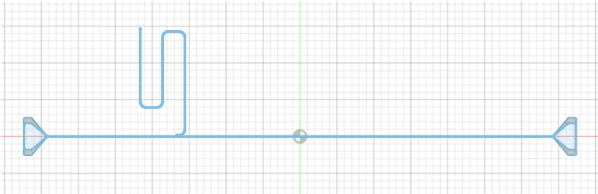
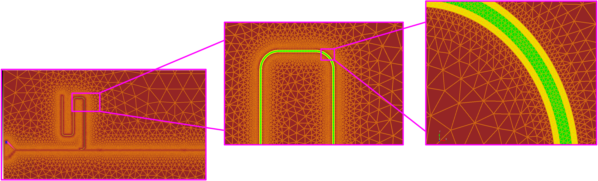
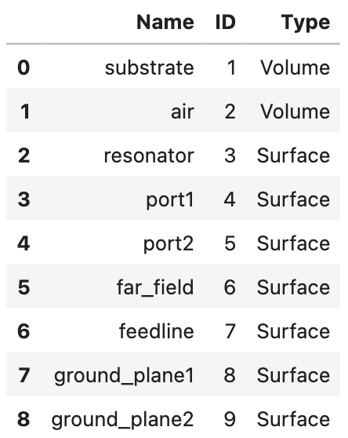

This example creates an AWS Palace config file for an eigenmode simulation of a superconducting circuit consisting of a single resonator hanging to a feedline (resonator 7 from [this paper](https://arxiv.org/pdf/2204.07202). 

Below are images of the device and its corresponding mesh.

Modified device to only include resonator 7:



Corresponding mesh:



## Creating an eigenmode config file for this device with pyPalace

The example outlined below can be found in [this python script](resonator_eigenmode_example.py) or this [this notebook](resonator_eigenmode_example.ipynb).

We start by importing the needed pyPalace libraries:

```python
from pypalace import Config, Domains, Boundaries, Solver, Simulation
```

First, we use ```Simulation.get_mesh_attributes()``` to print a dataframe of the attributes defined in our mesh file - this will help us define the config file in just a bit.

```python
meshfile = "single_resonator_mesh.bdf" 
my_attributes = Simulation.get_mesh_attributes(meshfile) # accepts .msh or .bdf files for now
my_attributes
```

This outputs the following pandas dataframe:



Now that we can conviently see all of the geometry attributes, we are ready to build our AWS Palace config file to simulate this device. 

Now let's create our Config object, which defines config["Problem"], and let's also create config["Model"]:
```python
my_sim = Config("Eigenmode",Output="resonator_eigenmode_output") # creates config["Problem"]

my_refinement = Model.Refinement(Tol = 1e-06,MaxIts = 6) # six iterations of adapative mesh refinement
my_sim.add_Model(meshfile,Refinement=my_refinement) # creates config["Model"]
```

Now we define our materials:
```python
# define materials
silicon = Domains.Material([1],1.0,11.45,0.0) # silicon 
air = Domains.Material([2],1.0,1.0,0.0) # air
my_materials = [silicon,air] # material list for input into add_Domains()
```

and our boundary conditions:
```python
# define boundary conditions
PECs = Boundaries.PEC([3,6,7,8,9]) # resonator, far field, feedline, ground plane(s)
Lumped1 = Boundaries.LumpedPort(Index=1,Attributes=[4],Direction="+X",R=50,L=0,C=0) # for Q_c calculations or to drive later
Lumped2 = Boundaries.LumpedPort(Index=2,Attributes=[5],Direction="-X",R=50,L=0,C=0)
my_BCs = [PECs,Lumped1,Lumped2] # boundary condition list for input into add_Boundaries()
```

now let's add config["Domains"] and config["Boundaries"] using our material and BC lists defined above.
```python
# add config["Domains"] and config["Boundaries"] using our material and BC lists above
my_sim.add_Domains(my_materials)
my_sim.add_Boundaries(my_BCs)
```

Define our eigenmode and linear solver parameters nd add them to the config["Solver"] block::
```python
eigenmode_params = Solver.Eigenmode(Target = 1.0,
                                    Tol = 1.0e-6,
                                    N = 5,
                                    Save = 5)

Linear_params = Solver.Linear(Type="Default",
                              KSPType = "Default",
                              Tol = 1e-6,
                              MaxIts = 10)
                              
my_sim.add_Solver(Simulation=eigenmode_params,Order = 1,Linear=Linear_params)
```

We have defined everything we need so let's print out the config file to see what it looks like:
```python
my_sim.print_config()
```
```
{
  "Problem": {
    "Type": "Eigenmode",
    "Verbose": 2,
    "Output": "resonator_eigenmode_output"
  },
  "Model": {
    "Mesh": "single_resonator_mesh.bdf",
    "L0": 1e-06,
    "Refinement": {
      "Tol": 1e-06,
      "MaxIts": 6
    }
  },
  "Domains": {
    "Materials": [
      {
        "Attributes": [
          1
        ],
        "Permeability": 1.0,
        "Permittivity": 11.45,
        "LossTan": 0.0
      },
      {
        "Attributes": [
          2
        ],
        "Permeability": 1.0,
        "Permittivity": 1.0,
        "LossTan": 0.0
      }
    ]
  },
  "Boundaries": {
    "PEC": {
      "Attributes": [
        3,
        6,
        7,
        8,
        9
      ]
    },
    "LumpedPort": [
      {
        "Index": 1,
        "Attributes": [
          4
        ],
        "Direction": "+X",
        "R": 50,
        "L": 0,
        "C": 0
      },
      {
        "Index": 2,
        "Attributes": [
          5
        ],
        "Direction": "-X",
        "R": 50,
        "L": 0,
        "C": 0
      }
    ]
  },
  "Solver": {
    "Order": 1,
    "Device": "CPU",
    "Eigenmode": {
      "N": 5,
      "Save": 5,
      "Type": "Default",
      "Target": 1.0,
      "Tol": 1e-06
    },
    "Linear": {
      "Type": "Default",
      "KSPType": "Default",
      "Tol": 1e-06,
      "MaxIts": 10
    }
  }
}
```

If it look's good, we are ready to save it! Note ```save_config()``` will also do a validity check and error out if it finds that you did not make a valid config file (e.g., you're missing an important block):
```python
my_sim.save_config("single_resonator.json")
